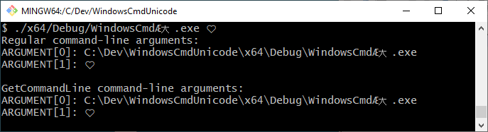

Small command-line tool for testing of the folllowing:
* Pass unicode characters as command-line arguments. The executable filename already has a `Æ大` suffix which should automatically show up in `argv[0]`.
* Print >2 byte "surrogate" unicode characters like `🤍` (U+1F90D white heart) back to the console.

### Known issues

|         Issue             |       Workaround       |
|---------------------------|------------------------|
| Non-ASCII characters in `argv[]` are truncated to `?` if using `int main(int argc, char* argv[])` as entry point. | Instead use `int wmain(int argc, wchar_t* argv[])` as entry point. |
| Windows command prompt (`cmd.exe`) seem unable to display >2 byte "surrogate" characters written to console. | Use bash shell instead. |

Please contact the repo author if you discover more problems or are aware of better solutions or workarounds.
